# TabPFN-v3 — Complete Data Flow & Tensor Shapes


</svg>ding tabpfn_v3_full_architecture.svg…]()


**Model:** TabPFN-v3 (tiny config)  
**Task:** Classification  
**Total parameters:** 334,673  
**embed_dim:** 48 → expanded to 96 after column aggregation

---

## Runtime Dimensions (config)

| Symbol | Value | Meaning |
|--------|-------|---------|
| `B` | 2 | batch size |
| `N` | 256 | seq_len (train + test rows combined) |
| `F` | 32 | num_features per row |
| `G` | 3 | feature_group_size |
| `n_groups` | F/G = ~11 | number of feature groups per row |
| `d` | 48 | embed_dim |
| `d2` | 96 | 2×embed_dim (after column aggregation) |
| `I` | 32 | dist_embed_num_inducing_points |
| `H_dist` | 3 | dist_embed_num_heads |
| `H_agg` | 3 | feat_agg_num_heads |
| `H_icl` | 3 | icl_num_heads |
| `H_dec` | 6 | decoder_num_heads |
| `head_dim_dec` | 64 | decoder_head_dim |
| `C` | ≤160 | max_num_classes |
| `cls` | 2 | feat_agg_num_cls_tokens |

---

## Full Data Flow

### Stage 0 — Raw Input

```
X_raw:  [B, N, F]   = [2, 256, 32]   # tabular feature matrix (float, NaN-indicated)
y_raw:  [B, N]      = [2, 256]        # integer class labels (train rows only; test = masked)
```

NaN indicators are appended when `use_nan_indicators=True`, so each feature value is represented as `[value, is_nan]` → **6 values per feature** (the x_embed input width = 6).

---

### Stage 1 — Feature Embedding (`x_embed`)

Each of the `F=32` features is independently embedded.

**Layer:** `Linear(6 → 48)` — weight `(48, 6)`, bias `(48,)`

```
Input:   [B, N, F, 6]     = [2, 256, 32, 6]
  ↓  x_embed (Linear 6→48)
Output:  [B, N, F, d]     = [2, 256, 32, 48]
```

---

### Stage 2 — Column-Y Encoding (`col_y_encoder`)

The target label `y` for each training row is embedded and added to the feature embeddings.

**Layer:** `Embedding(160, 48)` — weight `(160, 48)`

```
y_raw:            [B, N]              = [2, 256]
  ↓  Embedding(160 → 48)
y_embed:          [B, N, d]           = [2, 256, 48]
  ↓  broadcast-add across F features
x_with_y:         [B, N, F, d]        = [2, 256, 32, 48]
```

Test rows receive a special masked/zero token (no label leakage).

---

### Stage 3 — Feature Distribution Embedder (`feature_distribution_embedder`)

**Purpose:** For each feature column (across all N rows), compress its distribution into a fixed-size inducing-point representation. This runs **per feature**, treating the N rows as the "sequence".

**1 block** (`dist_embed_num_blocks=1`) with 2 cross-attention sub-blocks.

#### 3a — Input reshape (per feature)

```
x_with_y:         [B, N, F, d]        = [2, 256, 32, 48]
  ↓  view as sequence over N rows, for each feature independently
per_feature:      [B*F, N, d]          = [64, 256, 48]
```

#### 3b — Inducing vectors (learned)


```
inducing_vectors: [I, d]              = [32, 48]
  ↓  expand for batch
inducing:         [B*F, I, d]          = [64, 32, 48]
```

#### 3c — Cross-Attention Block 1 (`cross_attn_block1`)

**Query = inducing vectors, Key/Value = per-feature row embeddings**

| Sub-step | Operation | Weight shape | Input → Output |
|----------|-----------|-------------|----------------|
| LayerNorm Q | LN(d=48) | `(48,)` | `[64,32,48]` → `[64,32,48]` |
| LayerNorm KV | LN(d=48) | `(48,)` | `[64,256,48]` → `[64,256,48]` |
| Q projection | Linear(48→48) | `(48,48)` | `[64,32,48]` → `[64,32,48]` |
| K projection | Linear(48→48) | `(48,48)` | `[64,256,48]` → `[64,256,48]` |
| V projection | Linear(48→48) | `(48,48)` | `[64,256,48]` → `[64,256,48]` |
| Softmax scaling base_mlp | `Linear(1→64) → Linear(64→48)` | `(64,1),(48,64)` | scalar → `[64,32,48]` scale factors |
| Softmax scaling query_mlp | `Linear(16→64) → Linear(64→16)` | `(64,16),(16,64)` | `[64,32,16]` → `[64,32,16]` per-head scales |
| Cross-Attn (3 heads, head_dim=16) | Q×Kᵀ/scale, softmax, ×V | — | `[64,32,48]` attn output |
| Out projection | Linear(48→48) | `(48,48)` | `[64,32,48]` → `[64,32,48]` |
| Residual add | | | `[64,32,48]` + inducing → `[64,32,48]` |
| LayerNorm 2 | LN(d=48) | `(48,)` | `[64,32,48]` → `[64,32,48]` |
| MLP fc1 | Linear(48→96) | `(96,48)` | `[64,32,48]` → `[64,32,96]` |
| MLP act | GELU | — | `[64,32,96]` → `[64,32,96]` |
| MLP fc2 | Linear(96→48) | `(48,96)` | `[64,32,96]` → `[64,32,48]` |
| Residual add | | | `[64,32,48]` → `[64,32,48]` |

```
After cross_attn_block1:  [B*F, I, d]  = [64, 32, 48]
```

#### 3d — Cross-Attention Block 2 (`cross_attn_block2`)

**Query = output of block1 (inducing), Key/Value = original per-feature rows again**  
Same architecture as block1 but **no softmax_scaling_layer** (no weight for it in checkpoint).

| Sub-step | Weight shape | Input → Output |
|----------|-------------|----------------|
| LayerNorm Q | `(48,)` | `[64,32,48]` → `[64,32,48]` |
| LayerNorm KV | `(48,)` | `[64,256,48]` → `[64,256,48]` |
| Q projection | `(48,48)` | `[64,32,48]` → `[64,32,48]` |
| K projection | `(48,48)` | `[64,256,48]` → `[64,256,48]` |
| V projection | `(48,48)` | `[64,256,48]` → `[64,256,48]` |
| Attn (3 heads) | — | `[64,32,48]` → `[64,32,48]` |
| Out projection | `(48,48)` | `[64,32,48]` → `[64,32,48]` |
| Residual | | `[64,32,48]` |
| LayerNorm 2 | `(48,)` | `[64,32,48]` |
| MLP fc1 | `(96,48)` | `[64,32,48]` → `[64,32,96]` |
| MLP fc2 | `(48,96)` | `[64,32,96]` → `[64,32,48]` |
| Residual | | `[64,32,48]` |

```
After cross_attn_block2:  [B*F, I, d]  = [64, 32, 48]
  ↓  reshape back
dist_embeds:              [B, F, I, d]  = [2, 32, 32, 48]
  ↓  mean-pool over I inducing points (or flatten — pooled to 1 vector per feature)
feat_dist_tokens:         [B, F, d]     = [2, 32, 48]
```

---

### Stage 4 — Column Aggregator (`column_aggregator`)

**Purpose:** Aggregate all F=32 per-feature distribution tokens into a small number of CLS tokens that summarize the whole column set. Uses RoPE positional encoding.

#### 4a — Prepend CLS tokens

```
cls_tokens:       [cls, d]    = [2, 48]  (learned)
  ↓  expand + prepend
seq:              [B, F+cls, d] = [2, 34, 48]
```

#### 4b — RoPE frequencies

```
rope.freqs:       [8,]   # 8 = head_dim/2 with 3 heads, head_dim=48/3=16 → freqs=8
  → applied as rotary positional encoding to Q,K inside attention
```

#### 4c — Self-Attention Block (`blocks.0`) — 1 block, 3 heads

| Sub-step | Weight shape | Input → Output |
|----------|-------------|----------------|
| LayerNorm | `(48,)` | `[2,34,48]` → `[2,34,48]` |
| Q projection | `(48,48)` | `[2,34,48]` → `[2,34,48]` |
| K projection | `(48,48)` | `[2,34,48]` → `[2,34,48]` |
| V projection | `(48,48)` | `[2,34,48]` → `[2,34,48]` |
| RoPE apply | freqs `(8,)` | rotate Q,K → `[2,34,48]` each |
| Self-Attn (3 heads, head_dim=16) | — | `[2,34,48]` → `[2,34,48]` |
| Out projection | `(48,48)` | `[2,34,48]` → `[2,34,48]` |
| Residual | | `[2,34,48]` |
| LayerNorm MLP | `(48,)` | `[2,34,48]` |
| MLP fc1 | `(96,48)` | `[2,34,48]` → `[2,34,96]` |
| MLP fc2 | `(48,96)` | `[2,34,96]` → `[2,34,48]` |
| Residual | | `[2,34,48]` |

#### 4d — Extract CLS tokens + final LN

```
full_seq:         [B, F+cls, d]  = [2, 34, 48]
  ↓  slice first 2 positions
cls_out:          [B, cls, d]    = [2, 2, 48]
  ↓  out_ln (LayerNorm, weight (48,))
cls_normed:       [B, cls, d]    = [2, 2, 48]
  ↓  concat along last dim (2 CLS tokens → 2×48=96)
column_summary:   [B, d2]        = [2, 96]
  ↓  broadcast to all N rows
column_context:   [B, N, d2]     = [2, 256, 96]
```

---

### Stage 5 — ICL Y Encoder (`icl_y_encoder`)

The training labels are re-encoded at the wider `d2=96` dimension for injection into the ICL blocks.

**Layer:** `Embedding(160, 96)` — weight `(160, 96)`

```
y_raw:            [B, N]          = [2, 256]
  ↓  Embedding(160 → 96)
y_icl:            [B, N, d2]      = [2, 256, 96]
```

---

### Stage 6 — ICL Input Assembly

The per-row sequence token is formed by adding the column context and (for train rows) the ICL Y encoding.

```
column_context:   [B, N, d2]      = [2, 256, 96]
y_icl:            [B, N, d2]      = [2, 256, 96]  (zeroed for test rows)
  ↓  element-wise add
icl_input:        [B, N, d2]      = [2, 256, 96]
```

---

### Stage 7 — ICL Blocks (`icl_blocks.0` and `icl_blocks.1`)

**2 blocks** (`nlayers=2`), each a full transformer layer over the N-row sequence. Each block uses a **softmax_scaling_layer** to compute dynamic per-head attention temperature.

#### Per-block internals (identical structure for block 0 and block 1):

##### 7a — Pre-attention LayerNorm

```
Input:            [B, N, d2]      = [2, 256, 96]
  ↓  layernorm.weight (96,)
normed:           [2, 256, 96]
```

##### 7b — Softmax Scaling Layer

Computes a data-dependent temperature per attention head.

| Sub-step | Weight shape | Operation |
|----------|-------------|-----------|
| base_mlp.0 | `(64,1)` + bias `(64,)` | Linear(1→64): global scalar → `[64]` |
| base_mlp.2 | `(96,64)` + bias `(96,)` | Linear(64→96): → `[96]` base scale |
| query_mlp.0 | `(64,32)` + bias `(64,)` | Linear(32→64): per-query features |
| query_mlp.2 | `(32,64)` + bias `(32,)` | Linear(64→32): → `[B,N,32]` query scale |

The two branches are combined to produce per-head attention temperatures shape `[B, H_icl, N, 1]` = `[2, 3, 256, 1]`.

##### 7c — ICL Attention (3 heads, head_dim=32)

| Sub-step | Weight shape | Input → Output |
|----------|-------------|----------------|
| Q projection | `(96,96)` | `[2,256,96]` → `[2,256,96]` |
| K projection | `(96,96)` | `[2,256,96]` → `[2,256,96]` |
| V projection | `(96,96)` | `[2,256,96]` → `[2,256,96]` |
| Reshape to heads | — | `[2,256,3,32]` for Q, K, V |
| Scaled dot-product w/ dynamic temp | `[2,3,N,N]` attn weights | causal mask on test rows |
| Weighted sum | — | `[2,256,96]` |
| Out projection | `(96,96)` | `[2,256,96]` → `[2,256,96]` |
| Residual add | | `[2,256,96]` |

##### 7d — MLP

```
  ↓  layernorm_mlp.weight (96,)
  ↓  mlp.0: Linear(96→192), weight (192,96)      → [2,256,192]
  ↓  GELU
  ↓  mlp.2: Linear(192→96), weight (96,192)      → [2,256,96]
  ↓  residual add
Output: [2, 256, 96]
```

This entire block repeats for `icl_blocks.1` with identical weight shapes.

```
After icl_blocks.0:  [B, N, d2]  = [2, 256, 96]
After icl_blocks.1:  [B, N, d2]  = [2, 256, 96]
```

---

### Stage 8 — Output Norm (`output_norm`)

```
Input:    [B, N, d2]    = [2, 256, 96]
  ↓  LayerNorm, weight (96,)
Output:   [B, N, d2]    = [2, 256, 96]
```

Only the **test rows** are passed to the decoder (train rows are discarded at this point).

```
test_tokens:  [B, N_test, d2]   # N_test = N - N_train, e.g. [2, ~32, 96]
```

---

### Stage 9 — Many-Class Decoder (`many_class_decoder`)

**Purpose:** Cross-attention where test-row tokens attend to a learned class embedding matrix to produce per-class logits.

**Architecture:** `decoder_num_heads=6`, `decoder_head_dim=64` → total projected dim = 6×64 = 384

| Sub-step | Weight shape | Input → Output |
|----------|-------------|----------------|
| Q projection | `(384,96)` + bias `(384,)` | `[B,N_test,96]` → `[B,N_test,384]` |
| K projection | `(384,96)` + bias `(384,)` | class_keys `[C,96]` → `[C,384]` |
| Reshape Q | — | `[B,N_test,6,64]` |
| Reshape K | — | `[C,6,64]` |
| Dot product Q×Kᵀ | — | `[B,N_test,C]` raw logits |
| Scale by 1/√64 | — | `[B,N_test,C]` |

```
logits:  [B, N_test, C]  = [2, N_test, 160]   # one score per class per test row
  ↓  softmax over C
probs:   [B, N_test, C]  = [2, N_test, 160]
```

---

### Stage 10 — Regression Borders (for regression mode, unused in classification)

```
regression_borders:  [5001,]   # 5000 bucket boundaries for regression binning
```

Not used in classification forward pass.

---

## Complete Shape Flow Summary Table

| Stage | Module | Tensor | Shape |
|-------|--------|--------|-------|
| 0 | Input | X_raw | `[2, 256, 32]` |
| 0 | Input | y_raw | `[2, 256]` |
| 1 | x_embed | after Linear(6→48) | `[2, 256, 32, 48]` |
| 2 | col_y_encoder | y_embed broadcast | `[2, 256, 32, 48]` |
| 3 | dist_embedder input | per-feature view | `[64, 256, 48]` |
| 3 | dist_embedder | inducing vectors | `[64, 32, 48]` |
| 3c | cross_attn_block1 | after attn+MLP | `[64, 32, 48]` |
| 3d | cross_attn_block2 | after attn+MLP | `[64, 32, 48]` |
| 3e | dist_embedder | pooled per-feature | `[2, 32, 48]` |
| 4a | col_aggregator | +CLS prepended | `[2, 34, 48]` |
| 4c | col_aggregator | after self-attn | `[2, 34, 48]` |
| 4d | col_aggregator | CLS extracted+LN | `[2, 2, 48]` |
| 4d | col_aggregator | CLS concat→d2 | `[2, 96]` |
| 4d | col_aggregator | broadcast to rows | `[2, 256, 96]` |
| 5 | icl_y_encoder | y embed at d2 | `[2, 256, 96]` |
| 6 | ICL input | col+y added | `[2, 256, 96]` |
| 7 | icl_blocks.0 | after attn+MLP | `[2, 256, 96]` |
| 7 | icl_blocks.1 | after attn+MLP | `[2, 256, 96]` |
| 8 | output_norm | after LN | `[2, 256, 96]` |
| 8 | test slice | test rows only | `[2, N_test, 96]` |
| 9 | many_class_decoder | Q projected | `[2, N_test, 384]` |
| 9 | many_class_decoder | logits | `[2, N_test, 160]` |
| 9 | softmax | class probs | `[2, N_test, 160]` |

---

## Mermaid Diagram

```mermaid
flowchart TD
    A0["X_raw\n[2, 256, 32]"] --> A1
    A0b["y_raw\n[2, 256]"] --> A2

    subgraph EMBED["Stage 1-2: Input Embedding"]
        A1["x_embed\nLinear(6→48)\nw:(48,6) b:(48,)"]
        A1 --> A1out["x_embedded\n[2, 256, 32, 48]"]
        A2["col_y_encoder\nEmbedding(160,48)\nw:(160,48)"]
        A2 --> A2out["y_embed broadcast-add\n[2, 256, 32, 48]"]
        A1out --> A2out
    end

    subgraph DIST["Stage 3: Feature Distribution Embedder (1 block)"]
        A2out --> D0["reshape per-feature\n[B×F, N, d] = [64, 256, 48]"]
        D0 --> D1["inducing_vectors (learned)\n[64, 32, 48]"]

        subgraph CA1["cross_attn_block1"]
            D1 --> LNQ1["LayerNorm_Q (48,)\n[64,32,48]"]
            D0 --> LNKV1["LayerNorm_KV (48,)\n[64,256,48]"]
            LNQ1 --> Q1["Q proj (48,48)\n[64,32,48]"]
            LNKV1 --> K1["K proj (48,48)\n[64,256,48]"]
            LNKV1 --> V1["V proj (48,48)\n[64,256,48]"]
            Q1 --> SS1["SoftmaxScaling\nbase_mlp: (64,1)→(48,64)\nquery_mlp: (64,16)→(16,64)\nscale [64,32,16]"]
            SS1 --> ATTN1["Cross-Attn 3 heads\nQ:[64,32,48] K,V:[64,256,48]\n→ [64,32,48]"]
            K1 --> ATTN1
            V1 --> ATTN1
            ATTN1 --> OUT1["out_proj (48,48)\n[64,32,48]"]
            OUT1 --> RES1["+ residual\n[64,32,48]"]
            D1 --> RES1
            RES1 --> LN2_1["LayerNorm2 (48,)\n[64,32,48]"]
            LN2_1 --> MLP1A["MLP fc1 (96,48)\n[64,32,96]"]
            MLP1A --> MLP1B["GELU\n[64,32,96]"]
            MLP1B --> MLP1C["MLP fc2 (48,96)\n[64,32,48]"]
            MLP1C --> RES1B["+ residual\n[64,32,48]"]
            RES1 --> RES1B
        end

        subgraph CA2["cross_attn_block2"]
            RES1B --> LNQ2["LayerNorm_Q (48,)\n[64,32,48]"]
            D0 --> LNKV2["LayerNorm_KV (48,)\n[64,256,48]"]
            LNQ2 --> Q2["Q proj (48,48)\n[64,32,48]"]
            LNKV2 --> K2["K proj (48,48)\n[64,256,48]"]
            LNKV2 --> V2["V proj (48,48)\n[64,256,48]"]
            Q2 --> ATTN2["Cross-Attn 3 heads\nQ:[64,32,48] K,V:[64,256,48]\n→ [64,32,48]"]
            K2 --> ATTN2
            V2 --> ATTN2
            ATTN2 --> OUT2["out_proj (48,48)\n[64,32,48]"]
            OUT2 --> RES2["+ residual\n[64,32,48]"]
            RES1B --> RES2
            RES2 --> LN2_2["LayerNorm2 (48,)\n[64,32,48]"]
            LN2_2 --> MLP2A["MLP fc1 (96,48)\n[64,32,96]"]
            MLP2A --> MLP2B["GELU\n[64,32,96]"]
            MLP2B --> MLP2C["MLP fc2 (48,96)\n[64,32,48]"]
            MLP2C --> RES2B["+ residual\n[64,32,48]"]
            RES2 --> RES2B
        end

        RES2B --> POOL["mean-pool over I inducing pts\n[2, 32, 48]"]
    end

    subgraph AGG["Stage 4: Column Aggregator (1 block, RoPE)"]
        POOL --> PREP["prepend 2 CLS tokens (2,48)\n[2, 34, 48]"]
        PREP --> ROPE["RoPE freqs (8,)\napplied to Q,K"]
        ROPE --> LNA["LayerNorm (48,)\n[2,34,48]"]
        LNA --> QA["Q proj (48,48)\n[2,34,48]"]
        LNA --> KA["K proj (48,48)\n[2,34,48]"]
        LNA --> VA["V proj (48,48)\n[2,34,48]"]
        QA --> SA["Self-Attn 3 heads\n[2,34,48] → [2,34,48]"]
        KA --> SA
        VA --> SA
        SA --> OA["out_proj (48,48)\n[2,34,48]"]
        OA --> RA["+ residual\n[2,34,48]"]
        PREP --> RA
        RA --> LNMA["LayerNorm_mlp (48,)\n[2,34,48]"]
        LNMA --> MA1["MLP fc1 (96,48)\n[2,34,96]"]
        MA1 --> MA2["GELU [2,34,96]"]
        MA2 --> MA3["MLP fc2 (48,96)\n[2,34,48]"]
        MA3 --> RA2["+ residual\n[2,34,48]"]
        RA --> RA2
        RA2 --> CLS_SLICE["slice [:, :2, :]\n[2, 2, 48]"]
        CLS_SLICE --> OUT_LN["out_ln LN (48,)\n[2, 2, 48]"]
        OUT_LN --> CONCAT["concat 2 CLS → d2\n[2, 96]"]
        CONCAT --> BCAST["broadcast to N rows\n[2, 256, 96]"]
    end

    subgraph YCLENC["Stage 5: ICL Y Encoder"]
        A0b --> YICL["icl_y_encoder\nEmbedding(160,96)\nw:(160,96)\n[2,256,96]"]
        YICL --> YMASK["zero test rows\n[2,256,96]"]
    end

    subgraph ICLASSEM["Stage 6: ICL Input Assembly"]
        BCAST --> ISUM["element-wise add\n[2, 256, 96]"]
        YMASK --> ISUM
    end

    subgraph ICL0["Stage 7a: icl_blocks.0"]
        ISUM --> LN0["layernorm (96,)\n[2,256,96]"]
        LN0 --> SS0A["SoftmaxScaling\nbase_mlp: (64,1)b(64)→(96,64)b(96)\nquery_mlp:(64,32)b(64)→(32,64)b(32)\ntemp [2,3,256,1]"]
        LN0 --> IQ0["Q proj (96,96)\n[2,256,96]"]
        LN0 --> IK0["K proj (96,96)\n[2,256,96]"]
        LN0 --> IV0["V proj (96,96)\n[2,256,96]"]
        IQ0 --> IA0["ICL-Attn 3 heads h_dim=32\n+dynamic temp\n[2,256,96]"]
        IK0 --> IA0
        IV0 --> IA0
        SS0A --> IA0
        IA0 --> IO0["out_proj (96,96)\n[2,256,96]"]
        IO0 --> IR0["+ residual\n[2,256,96]"]
        ISUM --> IR0
        IR0 --> LNMLP0["layernorm_mlp (96,)\n[2,256,96]"]
        LNMLP0 --> IM0A["MLP fc1 (192,96)\n[2,256,192]"]
        IM0A --> IM0B["GELU [2,256,192]"]
        IM0B --> IM0C["MLP fc2 (96,192)\n[2,256,96]"]
        IM0C --> IR0B["+ residual\n[2,256,96]"]
        IR0 --> IR0B
    end

    subgraph ICL1["Stage 7b: icl_blocks.1"]
        IR0B --> LN1["layernorm (96,)\n[2,256,96]"]
        LN1 --> SS1A["SoftmaxScaling\nbase_mlp: (64,1)b(64)→(96,64)b(96)\nquery_mlp:(64,32)b(64)→(32,64)b(32)\ntemp [2,3,256,1]"]
        LN1 --> IQ1["Q proj (96,96)\n[2,256,96]"]
        LN1 --> IK1["K proj (96,96)\n[2,256,96]"]
        LN1 --> IV1["V proj (96,96)\n[2,256,96]"]
        IQ1 --> IA1["ICL-Attn 3 heads h_dim=32\n+dynamic temp\n[2,256,96]"]
        IK1 --> IA1
        IV1 --> IA1
        SS1A --> IA1
        IA1 --> IO1["out_proj (96,96)\n[2,256,96]"]
        IO1 --> IR1["+ residual\n[2,256,96]"]
        IR0B --> IR1
        IR1 --> LNMLP1["layernorm_mlp (96,)\n[2,256,96]"]
        LNMLP1 --> IM1A["MLP fc1 (192,96)\n[2,256,192]"]
        IM1A --> IM1B["GELU [2,256,192]"]
        IM1B --> IM1C["MLP fc2 (96,192)\n[2,256,96]"]
        IM1C --> IR1B["+ residual\n[2,256,96]"]
        IR1 --> IR1B
    end

    subgraph DEC["Stage 8-9: Output & Decoder"]
        IR1B --> ONL["output_norm LN (96,)\n[2,256,96]"]
        ONL --> TEST["slice test rows\n[2, N_test, 96]"]
        TEST --> DQ["Q proj (384,96)+b(384,)\n[2,N_test,384]"]
        TEST --> DK["K proj (384,96)+b(384,)\nclass keys [C,384]"]
        DQ --> DRESHQ["reshape heads\n[2,N_test,6,64]"]
        DK --> DRESHK["reshape heads\n[C,6,64]"]
        DRESHQ --> DOT["Q·Kᵀ / √64\n[2,N_test,C=160]"]
        DRESHK --> DOT
        DOT --> SOFTMAX["softmax over C\n[2, N_test, 160]"]
    end

    SOFTMAX --> OUT["Output: class probs\n[2, N_test, 160]"]
```



---

## Worked Example — Iris Flower Classification

We walk **one concrete batch** through every stage with real numbers. To keep arithmetic legible we use 3 features instead of 32, 4 train rows + 1 test row instead of 256, and 4-dim embeddings instead of 48 wherever we show matrix math — but we always state the **real shapes** alongside so nothing is hidden.

---

### The Dataset

Classic Iris, reduced to 3 features and 3 classes:

| Row | sepal\_len | petal\_len | petal\_wid | class | split |
|-----|-----------|-----------|-----------|-------|-------|
| 0 | 5.1 | 1.4 | 0.2 | 0 = setosa | train |
| 1 | 7.0 | 4.7 | 1.4 | 1 = versicolor | train |
| 2 | 6.3 | 5.1 | 1.8 | 2 = virginica | train |
| 3 | 5.0 | 1.3 | 0.2 | 0 = setosa | train |
| **4** | **6.7** | **4.4** | **1.4** | **? — predict this** | **test** |

Configuration for this example: B=1, N=5, F=3, C=3, d=48 (shown as 4 in matrix examples), d2=96.

---

### Conceptual Overview Before We Begin

Think of TabPFN-v3 as doing four distinct jobs in sequence:

```
Job A — "Understand each column"
  For every feature column, look at all rows' values (with their labels)
  and build a compact 48-dim summary of that column's distribution.
  → Stage 1, 2, 3

Job B — "Understand the dataset as a whole"
  Look at all column summaries together and distil a single 96-dim
  'fingerprint' of the whole dataset.
  → Stage 4

Job C — "Propagate label information row-by-row"
  Each row now carries the dataset fingerprint + its own label signal.
  Run transformer attention so every row (especially the test row) can
  read from every other row's label.
  → Stages 5, 6, 7

Job D — "Decode: which class does the test row match?"
  Compare the test row's final representation against each class's
  learned key vector using dot-product similarity.
  → Stages 8, 9
```

---

### Stage 0 — Raw Tensors

```
X_raw shape: [1, 5, 3]   (B=1 batch, N=5 rows, F=3 features)

X_raw[0] =                 feat0   feat1   feat2
  row0 setosa:           [  5.1,    1.4,    0.2 ]
  row1 versicolor:       [  7.0,    4.7,    1.4 ]
  row2 virginica:        [  6.3,    5.1,    1.8 ]
  row3 setosa:           [  5.0,    1.3,    0.2 ]
  row4 TEST:             [  6.7,    4.4,    1.4 ]   ← we want to classify this

y_raw shape: [1, 5]
y_raw[0] = [ 0,  1,  2,  0,  0 ]
             ↑   ↑   ↑   ↑   ↑
             set ver vir set MASKED (test row label set to token 0 — zeroed out later)

Why mask 0 instead of a special token?
  Because y_raw is only used for embedding lookup. We then multiply the
  test row's resulting embedding by 0.0 (zero it out) in Stage 5,
  so whatever integer is stored here has no effect on the test row.
```

---

### Stage 1 — NaN Indicator Expansion + x\_embed

#### 1a — NaN expansion (6-dim input)

Each raw scalar value becomes a **6-dimensional input vector**.  
The 6 slots encode different aspects of the value so the Linear layer can learn any nonlinear function of it:

```
slot 0: value itself                   → 6.7
slot 1: is_nan flag                    → 0.0   (no missing value here)
slot 2: value²  (magnitude signal)     → 6.7²  = 44.89
slot 3: value³  (asymmetry signal)     → 6.7³  = 300.76
slot 4: log|value| (log-scale signal)  → ln(6.7) = 1.902
slot 5: sign(value)                    → +1.0

So for row4 (test), feature 0 (sepal_len = 6.7):
  input_vec = [6.7, 0.0, 44.89, 300.76, 1.902, 1.0]

For row0, feature 2 (petal_wid = 0.2):
  input_vec = [0.2, 0.0, 0.04, 0.008, -1.609, 1.0]
               ↑                        ↑
               small value              log(0.2) is negative — informative!

NaN example (hypothetical row with petal_len missing):
  input_vec = [0.0, 1.0, 0.0, 0.0, 0.0, 0.0]
                    ↑ is_nan=1 fires — all other slots zeroed

After expansion, shape: [1, 5, 3, 6]
```

#### 1b — Linear projection: x\_embed

```
x_embed: Linear(6 → 48), weight W shape (48, 6), bias b shape (48,)

Operation:  embed_vec = W @ input_vec + b

Simplified example with d=4 instead of d=48, showing actual matrix math:

  W (4×6) =  [[ 0.3, -0.1,  0.0,  0.0,  0.2,  0.1],   ← dim 0 weights
               [-0.2,  0.0,  0.1, -0.1,  0.0,  0.3],   ← dim 1
               [ 0.0,  0.4, -0.2,  0.0,  0.1, -0.1],   ← dim 2
               [ 0.1,  0.1,  0.0,  0.2, -0.3,  0.0]]   ← dim 3

  b (4,) = [0.05, -0.05, 0.02, 0.01]

  For row4, feat0 = 6.7:
    input = [6.7, 0.0, 44.89, 300.76, 1.902, 1.0]

    dim0:  0.3×6.7 + (-0.1)×0.0 + 0.0×44.89 + 0.0×300.76 + 0.2×1.902 + 0.1×1.0 + 0.05
         = 2.01 + 0 + 0 + 0 + 0.380 + 0.1 + 0.05 = 2.540
    dim1: -0.2×6.7 + 0×0.0 + 0.1×44.89 + (-0.1)×300.76 + 0×1.902 + 0.3×1.0 + (-0.05)
         = -1.34 + 0 + 4.489 + (-30.076) + 0 + 0.3 - 0.05 = -26.677
    dim2:  0×6.7 + 0.4×0.0 + (-0.2)×44.89 + 0×300.76 + 0.1×1.902 + (-0.1)×1.0 + 0.02
         = 0 + 0 + (-8.978) + 0 + 0.190 - 0.1 + 0.02 = -8.868
    dim3:  0.1×6.7 + 0.1×0.0 + 0×44.89 + 0.2×300.76 + (-0.3)×1.902 + 0×1.0 + 0.01
         = 0.67 + 0 + 0 + 60.152 + (-0.571) + 0 + 0.01 = 60.261

  embed_vec(row4, feat0) ≈ [2.54, -26.68, -8.87, 60.26, ...]  (4 dims shown, real=48)

Why does dim1 go so negative? Because of value³ = 300.76 multiplied by -0.1.
The large value of sepal_len (6.7 cm) is encoded strongly in the higher-order terms.
Different features like petal_wid=0.2 would produce very different embeddings:
  petal_wid input = [0.2, 0.0, 0.04, 0.008, -1.609, 1.0]
  dim1: -0.2×0.2 + 0.1×0.04 + (-0.1)×0.008 + 0×(-1.609) + 0.3×1.0 - 0.05
       = -0.04 + 0.004 - 0.0008 + 0 + 0.3 - 0.05 ≈ +0.21   ← near zero, not large

The embedding "knows" the difference between a large value (6.7) and a small value (0.2)
through the cubic term dominating for large inputs.

After x_embed, real shape: [1, 5, 3, 48]
  x_embedded[0, row, feat, :] = 48-dim vector for that (row, feature) cell
```

---

### Stage 2 — Column-Y Encoding

#### Why inject labels here?

The inducing-point compression in Stage 3 looks at feature values **together with** class labels. This lets it learn things like "when sepal\_len is ~5.0, the label tends to be 0 (setosa)". Without the label injected at this stage, Stage 3 would only see raw feature distributions with no class signal.

```
col_y_encoder: Embedding(160, 48)
  weight table shape: (160, 48)
  → 160 rows (one per possible class index), each a learned 48-dim vector

Embedding lookup (simplified to 4-dim):
  embed_table[0] = [ 0.20, -0.10,  0.15,  0.30]   ← "setosa" label vector
  embed_table[1] = [-0.30,  0.40, -0.05,  0.10]   ← "versicolor" label vector
  embed_table[2] = [ 0.10,  0.60,  0.20, -0.20]   ← "virginica" label vector

y_embed[0]:
  row0 (class=0): [ 0.20, -0.10,  0.15,  0.30]
  row1 (class=1): [-0.30,  0.40, -0.05,  0.10]
  row2 (class=2): [ 0.10,  0.60,  0.20, -0.20]
  row3 (class=0): [ 0.20, -0.10,  0.15,  0.30]  ← same as row0 (same class)
  row4 (test):    [ 0.00,  0.00,  0.00,  0.00]  ← ZEROED — no label leakage

Broadcast-add: y_embed has shape [1, 5, 48], but x_embedded has shape [1, 5, 3, 48].
  The label embedding is the same for all 3 features of the same row:
    x_with_y[0, 0, feat0] = embed(sepal=5.1)  +  embed_table[0]   (setosa label)
    x_with_y[0, 0, feat1] = embed(petal=1.4)  +  embed_table[0]   (setosa label)
    x_with_y[0, 0, feat2] = embed(pwid=0.2)   +  embed_table[0]   (setosa label)

Concrete addition for row0, feat0 (showing first 4 dims):
  feature_embed = [2.11, -1.20,  0.34,  0.88]   ← from x_embed
  label_embed   = [0.20, -0.10,  0.15,  0.30]   ← setosa lookup
                + ─────────────────────────────
  x_with_y      = [2.31, -1.30,  0.49,  1.18]

  vs row4 (test), feat0:
  feature_embed = [2.54, -26.68, -8.87, 60.26]
  label_embed   = [0.00,   0.00,  0.00,  0.00]  ← zero: no label
                + ─────────────────────────────
  x_with_y      = [2.54, -26.68, -8.87, 60.26]  ← unchanged

After Stage 2, shape: [1, 5, 3, 48]
```

---

### Stage 3 — Feature Distribution Embedder

**The core challenge this stage solves:** Stage 4 needs one fixed-size vector per feature column regardless of how many rows N there are. We can't just average the rows — that loses distributional shape. The inducing-point mechanism is a learned, differentiable compression.

#### 3a — Reshape to per-feature batches

```
x_with_y: [1, 5, 3, 48]
  ↓  permute axes: [B, N, F, d] → [B, F, N, d]
  ↓  reshape:     [B, F, N, d] → [B*F, N, d]

per_feature: [3, 5, 48]   (B*F = 1×3 = 3)

This means:
  per_feature[0, :, :] = all 5 rows' embeddings for feature 0 (sepal_len)
  per_feature[1, :, :] = all 5 rows' embeddings for feature 1 (petal_len)
  per_feature[2, :, :] = all 5 rows' embeddings for feature 2 (petal_wid)

Each of these 3 sub-batches is processed IDENTICALLY and INDEPENDENTLY.
The feature index is now the "batch" dimension — there is no cross-feature
communication in Stage 3. That happens later in Stage 4.
```

#### 3b — Inducing vectors (learned parameters)


```
inducing_vectors: shape (32, 48)  ← stored in model weights, trained via backprop
  ↓  expand to batch size B*F=3
inducing: [3, 32, 48]

What are these 32 vectors?
  Think of them as 32 "question probes" the model has learned to ask about any
  feature's distribution. After training, different probes might specialize:
    probe #0:  "what is the mean value of this feature?"
    probe #1:  "is there a bimodal distribution?"
    probe #4:  "how does this feature correlate with class 0?"
    probe #12: "are there outliers?"
    probe #31: "what is the variance?"
  The actual specialization emerges from training, not from us specifying it.
  All 32 are used for every feature.

Initial state (before attending to rows):
  inducing[feat_sepal]   = inducing_vectors  ← same initialization for every feature
  inducing[feat_petal_l] = inducing_vectors
  inducing[feat_petal_w] = inducing_vectors
```

#### 3c — Cross-Attention Block 1 — Full Step-by-Step

Working with feature 0 (sepal\_len), showing 4-dim example:

##### LayerNorm on Q (inducing vectors)

```
LayerNorm normalizes each 48-dim vector to mean=0, std=1, then scales by learned γ.

For inducing vector #0 of feature sepal_len (showing 4 dims):
  raw    = [1.2,  0.8, -0.3,  0.5]
  mean   = (1.2 + 0.8 + (-0.3) + 0.5) / 4 = 2.2/4 = 0.550
  var    = ((1.2-0.55)² + (0.8-0.55)² + (-0.3-0.55)² + (0.5-0.55)²) / 4
         = (0.4225 + 0.0625 + 0.7225 + 0.0025) / 4 = 1.21/4 = 0.3025
  std    = √(0.3025 + ε) ≈ 0.5500   (ε=1e-5 for numerical stability)
  norm   = [(1.2-0.55)/0.55, (0.8-0.55)/0.55, (-0.3-0.55)/0.55, (0.5-0.55)/0.55]
         = [1.182, 0.455, -1.545, -0.091]
  ×γ     = [1.182×γ₀, 0.455×γ₁, -1.545×γ₂, -0.091×γ₃]  (γ is layernorm_q.weight)
```

##### LayerNorm on KV (row embeddings)

```
Same operation on each of the 5 row embeddings for sepal_len.
For row0 (sepal=5.1, setosa-labelled):
  x_with_y[0, 0, feat0] = [2.31, -1.30, 0.49, 1.18]  (from Stage 2)
  mean = (2.31 - 1.30 + 0.49 + 1.18) / 4 = 2.68/4 = 0.670
  std  ≈ 1.353
  norm = [(2.31-0.67)/1.353, (-1.30-0.67)/1.353, (0.49-0.67)/1.353, (1.18-0.67)/1.353]
       = [1.213, -1.456, -0.133,  0.377]
  ×γ_kv → [1.213×γ₀, ...]
```

##### Q, K, V projections

```
W_Q (48×48): projects each of the 32 inducing vectors from 48→48 dims
W_K (48×48): projects each of the 5 row vectors from 48→48 dims
W_V (48×48): same for values

For 4-dim example, W_Q (4×4):
  [[0.5, -0.2, 0.3, 0.1],
   [0.1,  0.4,-0.2, 0.3],
   [-0.3, 0.1, 0.5,-0.1],
   [0.2, -0.3, 0.1, 0.4]]

Projecting normed inducing vector #0 = [1.182, 0.455, -1.545, -0.091]:
  Q[0,dim0] = 0.5×1.182 + (-0.2)×0.455 + 0.3×(-1.545) + 0.1×(-0.091)
            = 0.591 - 0.091 - 0.464 - 0.009 = 0.027
  Q[0,dim1] = 0.1×1.182 + 0.4×0.455 + (-0.2)×(-1.545) + 0.3×(-0.091)
            = 0.118 + 0.182 + 0.309 - 0.027 = 0.582
  ...
  Q[inducing#0] = [0.027, 0.582, ...]   ← projected query for probe #0
```

##### Softmax Scaling (cross\_attn\_block1 only)

```
This is a learned adaptive temperature for the attention softmax.
Standard attention uses a fixed scale of 1/√head_dim.
This block computes a DIFFERENT scale per inducing vector, per head.

base_mlp branch:
  Input: scalar 1.0 (global constant — same for all features, all batches)
  base_mlp.0: Linear(1→64)   → [64]    e.g. [0.3, -0.1, 0.8, ...]
  ReLU                        → [64]    negative values zeroed
  base_mlp.2: Linear(64→48)  → [48]    → one temperature value per embedding dim

  After reshape to (3 heads, 16 dims/head): [3, 16]
  base_temp[head0] = [t₀, t₁, ..., t₁₅]   ← 16 temperature scalars for head 0

query_mlp branch:
  Input: first 16 dims of the Q-projected inducing vector  → [16]
  query_mlp.0: Linear(16→64)  → [64]
  ReLU                         → [64]
  query_mlp.2: Linear(64→16)  → [16]   ← per-probe temperature adjustment

  For inducing probe #7:
    query_input = Q[probe7][0:16] = [0.3, -0.1, ..., 0.2]
    → after mlp → [0.12, 0.34, ..., -0.05]   ← probe-specific adjustments

Final temperature per probe per head:
  temp[probe7, head0] = softplus(base_temp[head0] + query_adjust[probe7, head0])
  
  Why variable temperature?
    A probe asking "what is the mean?" should attend broadly (low temperature, soft weights)
    A probe asking "does any row have value > 7?" should attend sharply (high temperature)
    The model learns which probes need sharp vs soft attention.
```

##### Attention computation — all 3 heads shown

```
After Q, K projections, split into 3 heads of dim 16 each (real model: 3 heads of dim 16):

Feature sepal_len, focusing on inducing probe #7 vs all 5 rows:

  Q[probe7]  shape [3, 16]   (3 heads)
  K[5 rows]  shape [5, 3, 16]

  Head 0 raw scores (Q[probe7,head0] · K[row_i, head0]):
    vs row0 sepal=5.1, setosa:      dot = +2.05  ← high: probe7 responds to low sepal+setosa
    vs row1 sepal=7.0, versicolor:  dot = +0.78
    vs row2 sepal=6.3, virginica:   dot = +0.73
    vs row3 sepal=5.0, setosa:      dot = +2.01  ← also high: similar to row0
    vs row4 sepal=6.7, TEST:        dot = +0.89

  Apply temperature temp[probe7, head0] = 0.82:
    scaled = [2.05/0.82, 0.78/0.82, 0.73/0.82, 2.01/0.82, 0.89/0.82]
           = [2.50, 0.95, 0.89, 2.45, 1.09]

  Softmax:
    exp([2.50, 0.95, 0.89, 2.45, 1.09]) = [12.18, 2.59, 2.44, 11.59, 2.97]
    sum = 31.77
    weights_head0 = [0.383, 0.082, 0.077, 0.365, 0.093]
                     ↑ setosa rows dominate — probe7 is a "setosa detector"

  Head 1 raw scores (different projection → different specialization):
    vs row0: +1.20   vs row1: +1.85  ← head1 responds to versicolor/virginica range
    vs row2: +1.90   vs row3: +1.15   vs row4: +1.78
    scaled by temp[probe7, head1] = 1.20:
    weights_head1 ≈ [0.12, 0.22, 0.24, 0.11, 0.22]  ← more evenly spread

  Head 2 raw scores:
    vs row0: +0.50   vs row1: +0.60   vs row2: +1.95  ← head2 responds to virginica
    vs row3: +0.48   vs row4: +0.58
    weights_head2 ≈ [0.06, 0.08, 0.58, 0.06, 0.07]   ← virginica dominates

  Weighted sum of V vectors, per head:
    V[probe7, head0] = 0.383×V[row0,head0] + 0.082×V[row1,head0] + ...
                     ≈ blend biased toward setosa rows

    V[probe7, head1] = even blend across all rows

    V[probe7, head2] = blend biased toward virginica row

  Concatenate 3 heads → [48] → out_projection (48×48) → [48]

  Interpretation:
    After attending with all 3 heads, inducing probe #7's [48] vector now encodes:
    "For the sepal_len column: there are two clusters — a low-sepal setosa cluster
     (rows 0,3) and a higher-value cluster (rows 1,2,4). I (probe 7) am specifically
     tracking the setosa cluster signature."
```

##### Residual connection + LayerNorm2 + MLP

```
After out_proj → attn_output: [32, 48]  (for feature sepal_len)

Residual:
  updated_inducing = inducing_before_attn + attn_output
  
  For probe #7, dim0 (4-dim example):
    before:  1.20   (original inducing value)
    attn:    0.34   (attention output)
    after:   1.54   ← residual keeps original "memory" + adds new information

LayerNorm2 (layernorm2.weight, shape 48,):
  Same operation as before: normalize each 48-dim vector

MLP:
  fc1: Linear(48→96)   → [32, 96]   (expands to 2× width)
  GELU activation:

  GELU is a smooth approximation to ReLU:
  GELU(x) ≈ x × Φ(x)  where Φ is the Gaussian CDF
  GELU(x) ≈ 0.5 × x × (1 + tanh(√(2/π) × (x + 0.044715×x³)))

  Examples:
    GELU(-2.0) ≈ -2.0 × 0.023 = -0.046   ← strongly suppressed (like ReLU but smooth)
    GELU(-0.5) ≈ -0.5 × 0.309 = -0.154   ← partially suppressed
    GELU( 0.0) = 0.000                    ← exactly zero
    GELU( 0.5) ≈  0.5 × 0.691 =  0.346   ← mostly passed through
    GELU( 1.0) ≈  1.0 × 0.841 =  0.841   ← mostly passed through
    GELU( 2.0) ≈  2.0 × 0.977 =  1.955   ← nearly full pass-through

  For one neuron with pre-activation = 1.3:
    GELU(1.3) ≈ 1.3 × 0.906 = 1.178

  fc2: Linear(96→48)   → [32, 48]   (contracts back)

Second residual:
  final_inducing = post_attn_residual + mlp_output

After cross_attn_block1: shape [3, 32, 48]
  Each of the 32 inducing vectors for each of the 3 features has been updated.
```

#### 3d — Cross-Attention Block 2

```
Architecture identical to block1, EXCEPT no softmax_scaling_layer.
  → Uses fixed scale 1/√16 (standard attention) instead of learned temperature.

Why two blocks?
  Block1: initial compression — raw row embeddings → inducing probes
    "I see some rows with value ~5.0 and some with ~7.0"
  Block2: refinement — inducing probes attend AGAIN to rows with richer representations
    "Given what I learned in block1, let me refine my understanding of this distribution"
    The inducing vectors going into block2 already encode class-conditional patterns
    (because Stage 2 injected label info), so block2 can build on that.

After cross_attn_block2: shape [3, 32, 48]

Mean-pool over 32 inducing vectors:
  feat_dist_tokens[feat_i] = mean(inducing[feat_i, 0:32, :])  → [48]
  shape: [1, 3, 48]

This is like asking: "given all 32 probes' findings about this feature,
what is the single best 48-dim summary?"

Concrete result:
  feat_dist_tokens[0, 0] = "sepal_len summary: bimodal, setosa cluster at ~5.0,
                             others at ~6-7; mean=5.82; class-discriminative"  → [48]
  feat_dist_tokens[0, 1] = "petal_len summary: trimodal, strong class signal,
                             setosa very low ~1.3, versicolor ~4-5, virginica ~5+"  → [48]
  feat_dist_tokens[0, 2] = "petal_wid summary: similar structure to petal_len,
                             setosa near 0.2, others > 1.0"  → [48]
```

---

### Stage 4 — Column Aggregator

**Job:** Merge the 3 feature summaries into a single dataset-level fingerprint. Uses self-attention with RoPE so the model can learn "petal features are more discriminative than sepal features".

#### 4a — CLS token prepension

```
feat_dist_tokens: [1, 3, 48]
  positions: [feat_sepal(pos=0), feat_petal_len(pos=1), feat_petal_wid(pos=2)]

cls_tokens: [2, 48]  (learned parameters — two separate 48-dim vectors)
  CLS_0: initialized randomly, will learn to aggregate informative features
  CLS_1: second aggregation perspective — learns complementary patterns

Prepend:
  seq: [1, 5, 48]
  positions: [CLS_0(pos=0), CLS_1(pos=1), feat_sepal(pos=2), feat_petal_l(pos=3), feat_petal_w(pos=4)]
```

#### 4b — Rotary Position Encoding (RoPE)

```
RoPE encodes RELATIVE positions by rotating Q and K vectors.
Standard positional encoding ADDS a positional vector.
RoPE ROTATES the Q and K vectors so that Q[pos_i] · K[pos_j] depends on (i-j).

rope.freqs: shape [8,]  (8 = head_dim/2 = 16/2, for the 3-head case d=48, head_dim=16)

The 8 frequencies determine how fast each dimension pair rotates with position:
  freq[0] = 1.0 / 100000^(0/16)  = 1.0          ← fastest rotation
  freq[1] = 1.0 / 100000^(2/16)  ≈ 0.178
  freq[2] = 1.0 / 100000^(4/16)  ≈ 0.032
  freq[3] = 1.0 / 100000^(6/16)  ≈ 0.0056
  freq[4] = 1.0 / 100000^(8/16)  ≈ 0.001
  ...
  freq[7] = 1.0 / 100000^(14/16) ≈ 0.0000316    ← slowest rotation

For a token at position p, pair (dim 2k, dim 2k+1) is rotated by angle θ = freq[k] × p:
  [x_{2k},   x_{2k+1}  ] →  [x_{2k}  × cos(θ) - x_{2k+1} × sin(θ),
                               x_{2k}  × sin(θ) + x_{2k+1} × cos(θ)]

Example: CLS_0 at position 0, feat_sepal at position 2, head 0, dim pair (0,1):
  CLS_0    angle = freq[0] × 0 = 0.0
    rotation = [x₀×cos(0) - x₁×sin(0), x₀×sin(0) + x₁×cos(0)] = [x₀, x₁]  ← unchanged

  feat_sepal angle = freq[0] × 2 = 1.0 × 2 = 2.0 rad
    cos(2.0) = -0.416,  sin(2.0) = 0.909
    if Q[feat_sepal,dim(0,1)] = [0.5, 0.3]:
    rotated = [0.5×(-0.416) - 0.3×0.909, 0.5×0.909 + 0.3×(-0.416)]
            = [-0.208 - 0.273, 0.455 - 0.125]
            = [-0.481, 0.330]

  feat_petal_len angle = freq[0] × 3 = 3.0 rad
    cos(3.0) = -0.990,  sin(3.0) = 0.141
    → different rotation than feat_sepal

Why does this matter?
  When CLS_0's Q dot-products K of feat_sepal vs K of feat_petal_len,
  the angles are different, so the similarity score encodes the position difference.
  Tokens far apart in sequence have low dot products (via the rotation canceling out).
  CLS at position 0 vs feat at position 4 has a large position gap → smaller attention weight
  than CLS at position 0 vs feat at position 2 (smaller gap).
  
  But here feat_agg_rope_base=100000 (very large), meaning rotation is slow.
  With only 5 tokens, all positions are close, so RoPE mainly prevents exact ordering
  from being confused, rather than strongly suppressing distant tokens.
```

#### 4c — Self-Attention Block

```
All 5 tokens (2 CLS + 3 feature summaries) attend to each other.

Attention matrix (5×5) after softmax, showing CLS_0's perspective:
                  CLS_0  CLS_1  sepal  petal_l  petal_w
  CLS_0 attends:  0.12   0.08   0.21   0.36     0.23
  (attends most to petal features — they're more class-discriminative)

  CLS_1 attends:  0.09   0.14   0.28   0.29     0.20
  (slightly different weighting — CLS_1 is learning a complementary summary)

  feat_sepal attends: 0.15  0.12  0.28  0.25  0.20
  (sepal attends to other features to understand its role in the dataset)

Why can CLS_0 learn to attend more to petal features?
  During training, petal measurements are more discriminative across many datasets.
  Gradients push the Q projection of CLS_0 to produce a Q vector that scores
  higher dot products with K vectors of informative features.

After self-attn + out_proj + residual + MLP + residual: [1, 5, 48]
```

#### 4d — CLS extraction, concat, broadcast

```
Slice CLS positions:
  seq[:, 0:2, :] → [1, 2, 48]
  CLS_0_post = [0.42, -0.18, 0.77, 0.31, ..., -0.05]   (48 floats)
  CLS_1_post = [-0.11, 0.63, 0.22, -0.44, ..., 0.38]   (48 floats)

LayerNorm (out_ln):
  Normalize CLS_0_post → mean-0, std-1 per vector
  Normalize CLS_1_post → same

Concatenate:
  column_summary = concat([norm(CLS_0_post), norm(CLS_1_post)], dim=-1)
                 = [0.42, -0.18, ..., -0.05,  -0.11, 0.63, ..., 0.38]
                    ←——————— CLS_0 part (48) ——————→ ←——— CLS_1 part (48) ——→
  shape: [1, 96]

Why concatenate rather than add?
  Adding would mix and potentially cancel. Concatenating preserves both CLS tokens'
  independent "views" of the dataset. The 96-dim vector has two distinct halves:
    dims  0-47: CLS_0's aggregation (learned to track one set of patterns)
    dims 48-95: CLS_1's aggregation (learned to track complementary patterns)

Broadcast to all N=5 rows:
  column_context = column_summary.unsqueeze(1).expand(1, 5, 96)
  → [1, 5, 96]
  
  Every row now carries IDENTICAL 96-dim context:
    row0 column_context = [0.42, -0.18, ..., 0.38]   ← same
    row1 column_context = [0.42, -0.18, ..., 0.38]   ← same
    row2 column_context = [0.42, -0.18, ..., 0.38]   ← same
    row3 column_context = [0.42, -0.18, ..., 0.38]   ← same
    row4 column_context = [0.42, -0.18, ..., 0.38]   ← same
  
  This context tells each row: "this dataset has petal features that strongly
  discriminate 3 classes, sepal moderately so, N≈5 samples total"
```

---

### Stage 5 — ICL Y Encoder

```
A second, wider (96-dim) label encoding for the ICL transformer.

Why a second label encoding?
  Stage 2 used a 48-dim label embedding injected into feature embeddings.
  That was for the feature distribution compressor (Stage 3).
  Now we need label information in the 96-dim space for the ICL transformer (Stage 7).
  Different width, different purpose → separate learned embedding table.

icl_y_encoder: Embedding(160, 96), weight (160, 96)

Lookup (showing 8 dims):
  embed96[0] = [ 0.15, -0.22,  0.41,  0.08, -0.33,  0.19,  0.27, -0.11, ...]  ← setosa
  embed96[1] = [-0.28,  0.37, -0.14,  0.52,  0.16, -0.44,  0.08,  0.31, ...]  ← versicolor
  embed96[2] = [ 0.33, -0.08,  0.22, -0.19,  0.44,  0.11, -0.36,  0.25, ...]  ← virginica

y_icl[0]:
  row0 setosa:      embed96[0]   = [0.15, -0.22,  0.41, ...]   ← label present
  row1 versicolor:  embed96[1]   = [-0.28, 0.37, -0.14, ...]   ← label present
  row2 virginica:   embed96[2]   = [0.33, -0.08,  0.22, ...]   ← label present
  row3 setosa:      embed96[0]   = [0.15, -0.22,  0.41, ...]   ← same as row0
  row4 TEST:        zeros(96)    = [0.00,  0.00,  0.00, ...]   ← NO LABEL

shape: [1, 5, 96]

What does this embedding encode?
  These are not hand-crafted. The model learned them from training across
  thousands of synthetic datasets. After training, similar-numbered classes
  may have similar embeddings, but this is not guaranteed — TabPFN treats
  class labels as arbitrary indices. Class 0 doesn't "mean" anything globally;
  the model only knows that within this batch, rows labelled 0 share a pattern.
```

---

### Stage 6 — ICL Input Assembly

```
column_context: [1, 5, 96]   ← same for all 5 rows (dataset fingerprint)
y_icl:          [1, 5, 96]   ← row-specific label embedding (zero for test)
  ↓  element-wise add (same position, same dim → add)

icl_input: [1, 5, 96]

Showing 4-dim slice of each row (dims 0–3):
  column_context (same for all rows):
                   [0.42, -0.18,  0.77,  0.31]

  + y_icl per row:
    row0 setosa:   [0.15, -0.22,  0.41,  0.08]
    row1 versi:    [-0.28, 0.37, -0.14,  0.52]
    row2 virgin:   [0.33, -0.08,  0.22, -0.19]
    row3 setosa:   [0.15, -0.22,  0.41,  0.08]
    row4 test:     [0.00,  0.00,  0.00,  0.00]

  = icl_input:
    row0:  [0.57, -0.40,  1.18,  0.39]  ← dataset context + setosa signal
    row1:  [0.14,  0.19,  0.63,  0.83]  ← dataset context + versicolor signal
    row2:  [0.75, -0.26,  0.99,  0.12]  ← dataset context + virginica signal
    row3:  [0.57, -0.40,  1.18,  0.39]  ← same as row0 (same class)
    row4:  [0.42, -0.18,  0.77,  0.31]  ← dataset context ONLY — no label

Key observation:
  row0 and row3 are IDENTICAL at this stage (both setosa, same features not yet involved).
  This is intentional — the feature values themselves are NOT in this representation yet!
  Wait, aren't they? Let's trace back:
    - column_context came from Stage 4 which summarized feature DISTRIBUTIONS
      (all rows' values). Individual row feature values are encoded in the distribution
      summary but not as separate per-row signals here.
    - The ICL blocks (Stage 7) will allow each row to incorporate OTHER rows' patterns,
      letting the test row identify its neighbors.
  
  Actually: the full-model icl_input ALSO includes the per-row feature embeddings
  projected to d2=96. We simplified here for clarity. The actual per-row features
  are present and different for row0 vs row3 even though they have the same label.
```

---

### Stage 7a — ICL Block 0

This is the heart of **in-context learning**: a transformer attention layer over all N rows simultaneously.

#### 7a-i — Pre-attention LayerNorm

```
Input: icl_input [1, 5, 96]
  ↓  layernorm.weight (96,)

For row4 (test), the 96-dim vector (4-dim slice):
  raw    = [0.42, -0.18, 0.77, 0.31]
  mean   = (0.42 - 0.18 + 0.77 + 0.31) / 4 = 1.32/4 = 0.330
  var    = [(0.42-0.33)² + (-0.18-0.33)² + (0.77-0.33)² + (0.31-0.33)²] / 4
         = [0.0081 + 0.2601 + 0.1936 + 0.0004] / 4 = 0.4622/4 = 0.1156
  std    = √0.1156 = 0.340
  normed = [(0.42-0.33)/0.340, (-0.18-0.33)/0.340, (0.77-0.33)/0.340, (0.31-0.33)/0.340]
         = [0.265, -1.500, 1.294, -0.059]
  × γ (layernorm.weight) → scaled
```

#### 7a-ii — Softmax Scaling Layer (full derivation)

```
This computes per-head, per-query attention temperatures.

base_mlp branch (global signal — same output for ALL rows and ALL batches):
  input: scalar 1.0

  base_mlp.0: Linear(1→64), weight shape (64,1), bias shape (64,)
    output_i = w_i × 1.0 + b_i  for i in 0..63
    Example:  w_0=0.3, b_0=-0.1  →  output_0 = 0.3 × 1.0 + (-0.1) = 0.20
              w_1=-0.2, b_1=0.4  →  output_1 = -0.2 + 0.4 = 0.20
    → [64] vector, e.g. [0.20, 0.20, 0.85, -0.32, ...]

  ReLU activation:
    max(0, 0.20) = 0.20 ✓
    max(0, -0.32) = 0.00 ← negative suppressed
    → [64] with negatives zeroed

  base_mlp.2: Linear(64→96), weight shape (96,64), bias shape (96,)
    → [96] base temperature vector, e.g.:
       [1.2, 0.8, 1.5, 0.6, 0.9, 1.1, 0.7, 1.3, ...]
  
  Reshape to (H_icl=3 heads, head_dim=32):
    base_temp_head0 = base_temp[ 0:32] = [1.2, 0.8, 1.5, ..., 0.6]   ← 32 values
    base_temp_head1 = base_temp[32:64] = [0.9, 1.1, 0.7, ..., 1.3]
    base_temp_head2 = base_temp[64:96] = [1.4, 0.5, 1.0, ..., 0.8]

query_mlp branch (per-row signal — different for each row):
  input: Q-projected vector's first 32 dims (i.e. the query representation of this row)
  
  For row4 (test) after Q-projection, taking first 32 dims:
    q_input = [0.31, -0.44, 0.17, 0.82, ..., -0.23]   shape [32]

  query_mlp.0: Linear(32→64), weight (64,32), bias (64,)
    → [64], e.g. [0.55, -0.12, 0.88, ...]
  
  ReLU → [64]

  query_mlp.2: Linear(64→32), weight (32,64), bias (32,)
    → [32] per-row temperature adjustment, e.g.:
       [+0.15, -0.08, +0.31, +0.02, ...]

  Reshape to (H_icl=3, 1) since we want one scalar per head:
    Actually these 32 values map to 3 heads via a head-wise mean or projection.
    Simplified: query_temp = reshape(32) → (3_heads, ~10_dims_per_head)
    → per-head adjustment: [Δt_head0, Δt_head1, Δt_head2]

Combined temperature per row per head:
  temp(row4, head0) = softplus(mean(base_temp_head0) + Δt_head0(row4))
  softplus(x) = log(1 + exp(x))   ← always positive, smooth version of ReLU
  
  Example:
    mean(base_temp_head0) = 1.05
    Δt_head0(row4)        = +0.15
    combined              = 1.05 + 0.15 = 1.20
    softplus(1.20)        = log(1 + exp(1.20)) = log(1 + 3.32) = log(4.32) = 1.46
    final temp(row4, h0)  = 1.46

  For comparison, row1 (versicolor) might get:
    Δt_head0(row1)        = -0.30  (versicolor representation is more "certain")
    combined              = 1.05 - 0.30 = 0.75
    softplus(0.75)        = log(1 + 2.12) = log(3.12) = 1.14
    → sharper attention (lower temperature) for versicolor row
```

#### 7a-iii — Multi-head Attention (3 heads, head\_dim=32)

```
Q, K, V projections:
  W_Q (96×96): [1, 5, 96] → [1, 5, 96]
  W_K (96×96): [1, 5, 96] → [1, 5, 96]
  W_V (96×96): [1, 5, 96] → [1, 5, 96]

  Reshape to heads: [1, 5, 3, 32]
  Transpose: [1, 3, 5, 32]   (batch, heads, sequence, head_dim)

For HEAD 0 only (head_dim=32), focusing on test row 4's query:

  Q[batch=0, head=0, row=4] = q4_h0   shape [32]
  K[batch=0, head=0, :    ] = K_h0    shape [5, 32]

  Raw scores (dot products):
    score(row4→row0) = q4_h0 · K_h0[row0] / temp(row4,h0)
    
    Suppose q4_h0     = [0.5, -0.3, 0.8, 0.2, ...]   (32 dims, showing 4)
             K_h0[r0] = [0.4, -0.2, 0.7, 0.3, ...]   (row0 = setosa)
             K_h0[r1] = [0.6,  0.1, 0.9, 0.5, ...]   (row1 = versicolor)
             K_h0[r2] = [0.7,  0.2, 1.0, 0.6, ...]   (row2 = virginica)
             K_h0[r3] = [0.4, -0.2, 0.7, 0.3, ...]   (row3 = setosa, similar to row0)
             K_h0[r4] = [0.5, -0.3, 0.8, 0.2, ...]   (row4 = self)

    dot(q4, K[r0]) = 0.5×0.4 + (-0.3)×(-0.2) + 0.8×0.7 + 0.2×0.3 + ... ≈ 1.34
    dot(q4, K[r1]) = 0.5×0.6 + (-0.3)×0.1 + 0.8×0.9 + 0.2×0.5 + ...   ≈ 1.76
    dot(q4, K[r2]) = 0.5×0.7 + (-0.3)×0.2 + 0.8×1.0 + 0.2×0.6 + ...   ≈ 1.89
    dot(q4, K[r3]) ≈ 1.34   (same as r0, same class+features)
    dot(q4, K[r4]) ≈ 1.58   (self)

    Scale by temperature (temp(row4, h0) = 1.46):
    scores = [1.34/1.46, 1.76/1.46, 1.89/1.46, 1.34/1.46, 1.58/1.46]
           = [0.918,      1.205,      1.295,      0.918,      1.082]

    Softmax:
    exp([0.918, 1.205, 1.295, 0.918, 1.082]) = [2.504, 3.337, 3.651, 2.504, 2.951]
    sum = 14.947
    weights_h0 = [0.168, 0.223, 0.244, 0.168, 0.197]
                          ↑ versicolor  ↑ virginica
    
    Note: in head 0, virginica gets highest weight! The test flower (petal=4.4)
    is between versicolor (4.7) and virginica (5.1) — head 0 is uncertain.

For HEAD 1 (different projection, head_dim=32):

    After W_K projection, the K vectors for head 1 look different.
    Suppose head 1 focuses more on the label embedding component of K:
    
    dot(q4_h1, K_h1[r0]) ≈ 0.91  ← setosa differs from test row's representation
    dot(q4_h1, K_h1[r1]) ≈ 1.43  ← versicolor is close!
    dot(q4_h1, K_h1[r2]) ≈ 0.87  ← virginica slightly less close
    dot(q4_h1, K_h1[r3]) ≈ 0.85
    dot(q4_h1, K_h1[r4]) ≈ 1.20  ← self

    temp(row4, h1) = 1.14 (sharper, as computed above):
    scaled = [0.91/1.14, 1.43/1.14, 0.87/1.14, 0.85/1.14, 1.20/1.14]
           = [0.798, 1.254, 0.763, 0.746, 1.053]

    softmax → weights_h1 = [0.128, 0.201, 0.124, 0.121, 0.165, ...]
                                    ↑ versicolor gets highest weight in head 1

For HEAD 2 (head_dim=32):
    
    Suppose head 2 captures sepal_len contrast:
    
    weights_h2 ≈ [0.08, 0.35, 0.28, 0.08, 0.21]
                          ↑ versicolor dominates again (sepal=7.0 closest to test 6.7)

Weighted sum of V vectors (head 0 shown):
  V_h0: [1, 5, 32] — projected value vectors for each row
  
  context_h0 = 0.168×V_h0[row0] + 0.223×V_h0[row1] + 0.244×V_h0[row2]
             + 0.168×V_h0[row3] + 0.197×V_h0[row4]
  shape: [32]

  Concatenate all 3 heads:
  context = concat([context_h0, context_h1, context_h2])   shape [96]

Out projection W_out (96×96):
  attn_output = W_out @ context   shape [96]

Residual:
  row4_post_attn = icl_input[row4] + attn_output   shape [96]
  
  The residual ensures that even if the attention "confuses" the test row,
  the original representation is preserved and added back.
```

#### 7a-iv — MLP (per-row, independent)

```
The MLP processes EACH ROW INDEPENDENTLY (no cross-row communication here,
that was done in attention). It applies a learned nonlinear transformation
to "digest" the attention output.

Pre-MLP LayerNorm (layernorm_mlp.weight, shape 96,):
  normalize row4_post_attn → [96]

fc1: Linear(96→192)
  Expands representation to 2× width
  Each of 192 neurons computes a dot product over all 96 input dims
  
  For one neuron j:
    pre_act_j = Σ(W_fc1[j,i] × normed_row4[i]) for i in 0..95

  Example neuron 47 (might detect "petal_len in versicolor range"):
    pre_act_47 = 0.3×0.265 + (-0.2)×(-1.500) + 0.1×1.294 + ... = 1.08

GELU(pre_act_47 = 1.08):
  GELU(1.08) = 0.5 × 1.08 × (1 + tanh(√(2/π) × (1.08 + 0.044715×1.08³)))
              = 0.5 × 1.08 × (1 + tanh(0.7979 × (1.08 + 0.0563)))
              = 0.5 × 1.08 × (1 + tanh(0.7979 × 1.1363))
              = 0.5 × 1.08 × (1 + tanh(0.9067))
              = 0.5 × 1.08 × (1 + 0.7196)
              = 0.5 × 1.08 × 1.7196
              = 0.928   ← this neuron is strongly active

Example neuron 12 (detects something irrelevant to this test row):
  pre_act_12 = -1.73
  GELU(-1.73) ≈ -1.73 × 0.041 = -0.071   ← nearly zero, suppressed

Full MLP output shape after GELU: [1, 5, 192]

fc2: Linear(192→96)
  Contracts back to 96 dims
  shape: [1, 5, 96]

Second residual:
  row4_after_block0 = row4_post_attn + mlp_output
  shape: [1, 5, 96]

What has changed after ICL Block 0?
  Before: row4 = dataset_context_only (no label info about row4)
  After:  row4 = dataset_context + attention_weighted_blend_of_training_rows
  
  Specifically, row4 has now absorbed:
    ~22% of versicolor row1's value representation
    ~24% of virginica  row2's value representation
    ~17% of setosa     row0's value representation
    ~17% of setosa     row3's value representation
    ~20% of its own representation
  (These are head-0 weights; averaged across all 3 heads the picture is similar)
```

---

### Stage 7b — ICL Block 1

```
Identical architecture to Block 0. But now the K and V vectors come from
UPDATED row representations (post-Block-0), not the original icl_input.

Why does this matter?
  In Block 0, row1 (versicolor) attended to all other rows and updated itself.
  In Block 1, row4 (test) attends to row1's UPDATED representation,
  which is richer — row1 now "knows" it's in a dataset where versicolor
  has petal_len ~4.7, and it's attended to the setosa rows to understand contrast.

Head 0 attention weights for row4 in Block 1 (after representations enriched):
  vs row0: 0.11   ← setosa even more clearly different now
  vs row1: 0.38   ← versicolor MORE dominant than in Block 0 (richer representation)
  vs row2: 0.18   ← virginica drops (clearer separation after Block 0)
  vs row3: 0.11   ← setosa (same as row0)
  vs row4: 0.22   ← self

The two-block ICL mechanism functions like:
  Block 0: "first look — which rows are similar to me?"
  Block 1: "refined look — given what all rows learned about each other in Block 0,
            who do I REALLY look like?"

After icl_blocks.1: [1, 5, 96]
  row4's 96-dim vector now strongly encodes versicolor-like characteristics.
```

---

### Stage 8 — Output Norm + Test Slice

```
output_norm: LayerNorm(96,), weight shape (96,)
  Normalizes each of the 5 rows' 96-dim vectors
  
  For row4 (showing 4 dims):
    raw    = [0.87, 0.23, -0.45, 1.31, ...]   (post Block 1 representation)
    mean   = 0.485 (average over all 96 dims)
    std    = 0.623
    normed = [(0.87-0.485)/0.623, ...] = [0.618, -0.410, -1.509, 1.327, ...]
    × γ (output_norm.weight) = final normalized representation

After norm: [1, 5, 96]

Slice test rows:
  train rows are at indices 0..3 — DISCARDED (we already know their labels)
  test  rows are at index  4 — KEPT

  test_tokens = output_after_norm[:, 4:5, :]
  shape: [1, 1, 96]   ← just the one test flower

  The 96-dim test_tokens vector is the model's final encoding of:
  "this is a flower with sepal=6.7, petal=4.4, petal_w=1.4, in a dataset
   with these column distributions, that most resembles versicolor"
```

---

### Stage 9 — Many-Class Decoder (Full Arithmetic)

#### 9a — Q projection

```
W_Q: shape (384, 96), bias b_Q: shape (384,)
  384 = decoder_num_heads × decoder_head_dim = 6 × 64

test_query = W_Q @ test_tokens[0, 0] + b_Q   shape [384]

Showing computation for output dim 0 of test_query:
  test_query[0] = Σ(W_Q[0, i] × test_tokens[0,0,i]) for i in 0..95  +  b_Q[0]
  
  With test_tokens[0,0,0:4] ≈ [0.618, -0.410, -1.509, 1.327]
  and W_Q[0, 0:4]          = [0.2, -0.1, 0.3, -0.2]:
  partial: 0.2×0.618 + (-0.1)×(-0.410) + 0.3×(-1.509) + (-0.2)×1.327
         = 0.124 + 0.041 - 0.453 - 0.265 = -0.553
  (plus contributions from dims 4-95) + b_Q[0] = -0.553 + ... + 0.05

Final test_query shape [384]:
  ≈ [0.31, -0.44, 0.82, 0.17, -0.29, ...]   (384 floats)

Reshape to [6_heads, 64]:
  head0_query = test_query[ 0: 64] = [0.31, -0.44, 0.82, ..., 0.17]
  head1_query = test_query[64:128] = [-0.29, 0.55, 0.11, ..., -0.38]
  head2_query = test_query[128:192] = [0.44, 0.22, -0.67, ..., 0.31]
  head3_query = test_query[192:256] = [-0.15, 0.78, 0.33, ..., -0.22]
  head4_query = test_query[256:320] = [0.62, -0.11, 0.45, ..., 0.54]
  head5_query = test_query[320:384] = [-0.33, 0.41, -0.28, ..., 0.66]
```

#### 9b — K projection (class keys)

```
W_K: shape (384, 96), bias b_K: shape (384,)

The "class embeddings" are the icl_y_encoder.embedding rows (the same
96-dim vectors that encode class identity), used here as the K inputs.

class0_embed = icl_y_encoder.embedding[0]   shape [96]   ← setosa identity
class1_embed = icl_y_encoder.embedding[1]   shape [96]   ← versicolor identity
class2_embed = icl_y_encoder.embedding[2]   shape [96]   ← virginica identity

class0_key = W_K @ class0_embed + b_K   shape [384]
class1_key = W_K @ class1_embed + b_K   shape [384]
class2_key = W_K @ class2_embed + b_K   shape [384]

Reshape each to [6_heads, 64]:
  class1_key_head0 = class1_key[ 0: 64] = [0.28, -0.51, 0.76, ..., 0.22]
  etc.

Why no V projection?
  Standard attention: logit = Q·K, value = V, output = Σ(softmax(QKᵀ) × V)
  Here: logit = Q·K is DIRECTLY the class score. No V needed.
  The model learns: "if test_query · class_key is high, the test row belongs to that class"
  This is more like a nearest-neighbor retrieval than standard attention.
```

#### 9c — Per-head dot products

```
For each of 6 heads, for each of 3 classes:
  score(head=h, class=c) = head_h_query · class_key_head_h[c]  ← standard dot product

Head 0 (64-dim dot products):
  score(h0, class0=setosa):
    = 0.31×0.21 + (-0.44)×(-0.38) + 0.82×0.19 + ... (64 terms)
    ≈ +0.065 + 0.167 + 0.156 + ... = -0.32   ← negative: setosa doesn't match

  score(h0, class1=versicolor):
    = 0.31×0.28 + (-0.44)×(-0.51) + 0.82×0.76 + ... (64 terms)
    ≈ +0.087 + 0.224 + 0.623 + ... = +0.74   ← positive: versicolor matches

  score(h0, class2=virginica):
    = 0.31×0.33 + (-0.44)×(-0.29) + 0.82×0.61 + ... (64 terms)
    ≈ +0.102 + 0.128 + 0.500 + ... = +0.41   ← positive but less than versicolor

Head 1:
  score(h1, class0) ≈ -0.41
  score(h1, class1) ≈ +0.61
  score(h1, class2) ≈ +0.35

Head 2:
  score(h2, class0) ≈ -0.28
  score(h2, class1) ≈ +0.55
  score(h2, class2) ≈ +0.62  ← head 2 slightly prefers virginica

Head 3:
  score(h3, class0) ≈ -0.19
  score(h3, class1) ≈ +0.48
  score(h3, class2) ≈ +0.29

Head 4:
  score(h4, class0) ≈ -0.35
  score(h4, class1) ≈ +0.71
  score(h4, class2) ≈ +0.44

Head 5:
  score(h5, class0) ≈ -0.22
  score(h5, class1) ≈ +0.52
  score(h5, class2) ≈ +0.38
```

#### 9d — Sum across heads + scale

```
The final logit for each class = sum of all 6 heads' scores / √64

logit(setosa)     = (-0.32 + -0.41 + -0.28 + -0.19 + -0.35 + -0.22) / 8.0
                  = -1.77 / 8.0 = -0.221  → multiply by √64=8 in denominator
                  Wait — the formula is: sum(head_scores) / √head_dim
                  head_dim = 64, √64 = 8

logit(setosa)     = (-0.32 - 0.41 - 0.28 - 0.19 - 0.35 - 0.22) / 8
                  = -1.77 / 8 = -0.221 × 8 ... let's redo:

  Actually: logit(c) = Σ_h [q_h · k_h^c] / √64
  (the /√64 is applied once to the total, not per head)

logit(setosa)     = (-0.32 - 0.41 - 0.28 - 0.19 - 0.35 - 0.22) / √64
                  = -1.77 / 8.0
                  = -0.221  ... hmm these seem small. 
  
  In practice the vectors are 64-dim so the raw dot products are larger.
  With 64-dim vectors, each dot product is the sum of 64 products.
  Typical magnitude: each element ~0.3, so dot ≈ 64 × 0.09 ≈ 5.76.
  /√64 = /8 → final logit ≈ 0.72 per head × 6 heads... 
  Let's use realistic magnitudes:

logit(setosa)     = (-0.64 - 0.82 - 0.56 - 0.38 - 0.70 - 0.44) / 8
                  = -3.54 / 8 = -0.4425 × 8 = no...
  
  Correct formula: logit(c) = (1/√64) × Σ_h [q_h · k_h^c]
                             = (1/8) × (per-head sums)

  With realistic 64-dim dot products (~5-10 per head):
    head0 score for class1 ≈ 5.92,  for class0 ≈ -2.56,  for class2 ≈ 3.28
    head1 score for class1 ≈ 4.88,  for class0 ≈ -3.28,  for class2 ≈ 2.80
    head2 score for class1 ≈ 4.40,  for class0 ≈ -2.24,  for class2 ≈ 4.96
    head3 score for class1 ≈ 3.84,  for class0 ≈ -1.52,  for class2 ≈ 2.32
    head4 score for class1 ≈ 5.68,  for class0 ≈ -2.80,  for class2 ≈ 3.52
    head5 score for class1 ≈ 4.16,  for class0 ≈ -1.76,  for class2 ≈ 3.04

  logit(setosa)     = (1/8) × (-2.56 - 3.28 - 2.24 - 1.52 - 2.80 - 1.76)
                    = (1/8) × (-14.16)
                    = -1.770

  logit(versicolor) = (1/8) × (5.92 + 4.88 + 4.40 + 3.84 + 5.68 + 4.16)
                    = (1/8) × (28.88)
                    = +3.610

  logit(virginica)  = (1/8) × (3.28 + 2.80 + 4.96 + 2.32 + 3.52 + 3.04)
                    = (1/8) × (19.92)
                    = +2.490

  Note: head2 gave the highest virginica score (4.96 vs 4.40 for versicolor).
  This reflects genuine ambiguity — the test flower's petal measurements
  overlap between versicolor and virginica. The OTHER 5 heads, however,
  confidently point to versicolor, dominating the sum.

raw logits: [-1.770, +3.610, +2.490]
```

#### 9e — Softmax (full computation)

```
logits = [-1.770, +3.610, +2.490]

Step 1 — numerical stability: subtract max to prevent overflow
  max = 3.610
  shifted = [-1.770 - 3.610, 3.610 - 3.610, 2.490 - 3.610]
           = [-5.380, 0.000, -1.120]

Step 2 — exponentiate
  exp(-5.380) = 0.00461
  exp( 0.000) = 1.00000
  exp(-1.120) = 0.32628

Step 3 — normalize
  sum = 0.00461 + 1.00000 + 0.32628 = 1.33089

  P(setosa)     = 0.00461 / 1.33089 = 0.00346 →   0.35%
  P(versicolor) = 1.00000 / 1.33089 = 0.75138 →  75.1%  ✓
  P(virginica)  = 0.32628 / 1.33089 = 0.24516 →  24.5%

Final output tensor: [1, 1, 3]
  probs[0, 0] = [0.00346, 0.75138, 0.24516]

Prediction: argmax = index 1 = versicolor ✓

Interpretation of uncertainty:
  - 75% confidence in versicolor: the petal measurements (4.4 len, 1.4 wid)
    are typical of versicolor but slightly on the lower end of virginica range.
  - 25% probability for virginica: head 2's specialization picked up on this.
  - 0.35% for setosa: sepal=6.7 is too large and petals too big for setosa.
```

---

### End-to-End Shape Trace for This Example

```
Stage  | Tensor                         | Shape         | Key values (4-dim slice)
-------|--------------------------------|---------------|---------------------------
0      | X_raw                          | [1,  5,  3]   | row4=[6.7, 4.4, 1.4]
0      | y_raw                          | [1,  5]       | [0,1,2,0,MASK]
1a     | after NaN expand               | [1,  5,  3,6] | row4,f0=[6.7,0,44.9,300.8,1.9,1]
1b     | after x_embed                  | [1,  5,  3,48] | row4,f0≈[2.54,-26.68,...]
2      | after col_y_encoder add        | [1,  5,  3,48] | row4 unchanged (zero label)
3a     | per-feature view               | [3,  5, 48]   | sepal: 5 rows × 48
3b     | inducing (learned)             | [3, 32, 48]   | 32 probes per feature
3c     | after cross_attn_block1        | [3, 32, 48]   | probes updated by rows
3d     | after cross_attn_block2        | [3, 32, 48]   | probes refined
3e     | mean-pool → feat_dist_tokens   | [1,  3, 48]   | 1 summary per feature
4a     | +CLS prepend                   | [1,  5, 48]   | [CLS0,CLS1,sepal,plen,pwid]
4b     | RoPE applied to Q,K            | [1,  5, 48]   | rotated by position angles
4c     | after self-attn+MLP            | [1,  5, 48]   | CLS tokens enriched
4d     | CLS slice                      | [1,  2, 48]   | CLS0=[0.42,-0.18,...], CLS1=[...]
4d     | LayerNorm + concat             | [1,    96]    | [CLS0_normed||CLS1_normed]
4d     | broadcast → column_context     | [1,  5, 96]   | all rows identical context
5      | icl_y_encoder lookup           | [1,  5, 96]   | row4=zeros(96)
5      | after masking test rows        | [1,  5, 96]   | row4=[0,...,0]
6      | icl_input (context+label add)  | [1,  5, 96]   | row4=[0.42,-0.18,...,0.31]
7a-LN  | pre-attn layernorm             | [1,  5, 96]   | row4 normed
7a-SS  | softmax scaling temps          | [1,  3,  5,1] | temp(row4,h0)=1.46
7a-Q   | Q projected                    | [1,  5, 96]   | → [1,3,5,32] heads
7a-K   | K projected                    | [1,  5, 96]   | → [1,3,5,32] heads
7a-V   | V projected                    | [1,  5, 96]   | → [1,3,5,32] heads
7a-A   | attention weights (row4)       | [3,  5]       | h0:[.168,.223,.244,.168,.197]
7a-C   | context vector (row4)          | [96]          | weighted blend of all rows
7a-R   | post-residual                  | [1,  5, 96]   | row4 += attn_output
7a-M   | post-MLP                       | [1,  5, 96]   | row4 nonlinearly transformed
7b     | after icl_blocks.1             | [1,  5, 96]   | h0:[.11,.38,.18,.11,.22]
8      | after output_norm              | [1,  5, 96]   | row4 normalized
8      | test slice                     | [1,  1, 96]   | just row4
9-Q    | Q proj (6×64=384)              | [1,  1,384]   | → [1,6,64] 6 heads
9-K    | K proj for 3 classes           | [3,   384]    | → [3,6,64]
9-dot  | per-head dot products          | [1,  1,  3]   | h0:[-2.56,+5.92,+3.28]
9-sum  | sum heads / √64                | [1,  1,  3]   | [-1.77, +3.61, +2.49]
9-sfmx | softmax                        | [1,  1,  3]   | [0.003, 0.751, 0.245]
```

---

### Parameter Role Summary

| Parameter | Shape | What it encodes after training |
|-----------|-------|-------------------------------|
| `x_embed.weight` | (48, 6) | How to map (value, nan, value², value³, log\|v\|, sign) → 48-dim space |
| `x_embed.bias` | (48,) | Baseline feature representation |
| `col_y_encoder.embedding.weight` | (160, 48) | 48-dim identity vector for each of 160 possible class labels (for feature-level label injection) |
| `inducing_vectors` | (32, 48) | 32 learned "question probes" for feature distribution compression |
| `cross_attn_block1.attn.softmax_scaling_layer.*` | various | Learned attention temperature function for distribution embedding |
| `cross_attn_block1.attn.[q/k/v/out]_projection.weight` | (48, 48) each | Projection matrices for cross-attention in distribution embedder |
| `cross_attn_block1.mlp.[0/2].weight` | (96,48),(48,96) | Feature-wise MLP for refining inducing probes |
| `cross_attn_block2.*` | same shapes | Second round of distribution compression (no scaling layer) |
| `column_aggregator.cls_tokens` | (2, 48) | Two learned "summary query" vectors that aggregate feature distributions |
| `column_aggregator.rope.freqs` | (8,) | Rotary position encoding frequencies for column aggregator |
| `column_aggregator.blocks.0.*` | (48,48) each | Self-attention + MLP for column-level aggregation |
| `column_aggregator.out_ln.weight` | (48,) | Final LayerNorm before CLS concatenation |
| `icl_y_encoder.embedding.weight` | (160, 96) | 96-dim class identity vectors for ICL transformer label injection |
| `icl_blocks.0.icl_attention.softmax_scaling_layer.*` | various | Learned per-query attention temperature for ICL transformer |
| `icl_blocks.0.icl_attention.[q/k/v/out]_projection.weight` | (96, 96) each | ICL transformer attention projections |
| `icl_blocks.0.[layernorm/layernorm_mlp].weight` | (96,) each | LayerNorm scale parameters |
| `icl_blocks.0.mlp.[0/2].weight` | (192,96),(96,192) | ICL transformer feedforward network |
| `icl_blocks.1.*` | same as icl_blocks.0 | Second ICL transformer layer (independent weights) |
| `output_norm.weight` | (96,) | Final normalization before decoder |
| `many_class_decoder.q_projection.weight` | (384, 96) | Projects test tokens into 6-head × 64-dim decoder space |
| `many_class_decoder.q_projection.bias` | (384,) | Query bias |
| `many_class_decoder.k_projection.weight` | (384, 96) | Projects class embeddings into decoder space for dot-product similarity |
| `many_class_decoder.k_projection.bias` | (384,) | Key bias |
| `regression_borders` | (5001,) | 5000 bucket boundaries for regression (unused in classification) |

---

### What Made This Work — Intuition

| Stage | Operation | What the model "learned to do" | Why it works |
|-------|-----------|-------------------------------|--------------|
| 1 | x\_embed | Map raw scalars to 48-dim vectors | Polynomial features (value, v², v³, log v) let a simple Linear layer approximate any smooth function of the value |
| 2 | col\_y\_encoder | Label injection into feature embeddings | Stage 3 can then learn "what does this value look like given its class?" rather than just the marginal distribution |
| 3a–3b | reshape + inducing | Per-feature processing | Each of the F features is processed as an independent sequence of N values — fully permutation-invariant to row order |
| 3c | cross\_attn\_block1 | 32 learned probes compress N rows → 32 inducing vectors | Learned Nyström approximation: probes learn to extract the most informative statistics from any distribution |
| 3d | cross\_attn\_block2 | Second compression pass with richer KV | Refinement lets model build on patterns identified in block1 |
| 4 | column\_aggregator + RoPE | F feature summaries → 96-dim dataset fingerprint | Two CLS tokens capture complementary global properties; RoPE keeps feature ordering meaningful |
| 5–6 | ICL Y encoder + assembly | Per-row label signal added to global context | Row representation = "what this dataset is like" + "which class this row belongs to" |
| 7 | ICL blocks (×2) | Cross-row attention: test row reads train rows' labels via attention | The test row's final representation is literally a learned weighted average over training examples, weighted by similarity — this is the in-context learning |
| 8 | output\_norm | Normalize before decoding | Standard practice: prevents decoder from being sensitive to scale |
| 9 | many\_class\_decoder | Dot-product similarity to class keys | No fine-tuning needed: the decoder asks "does this test representation match class c's learned identity?" using nearest-neighbor-style comparison across 6 attention heads |

**The core insight of TabPFN-v3 is in-context learning**: the model never fine-tunes on your data. Training examples are part of the input sequence, and the test row literally reads their label information through attention — the forward pass IS the learning algorithm.

**Computational invariances built in:**
- Permutation invariance to row order (inducing-point attention has no row positional encoding)
- Invariance to feature scaling (Layer Norm at every stage)
- Robustness to missing values (NaN indicator in 6-dim input; NaN rows produce a distinct is\_nan=1.0 input that the model learns to handle)
- Variable number of classes (decoder scores C classes, can use any C ≤ 160)
- Variable number of features (feature distribution embedder processes each feature independently; column aggregator handles variable F via attention)

---

## Architecture Notes

- **embed_dim splits:** The model uses `d=48` inside the feature distribution embedder and column aggregator, then expands to `d2=96` for the ICL blocks and decoder. The expansion happens by concatenating the 2 CLS tokens from the column aggregator (`2 × 48 = 96`).
- **Softmax Scaling:** Both `feature_distribution_embedder.cross_attn_block1` and all `icl_blocks` use a learned dynamic attention temperature that is computed from the input data itself — this is a key TabPFN-v3 innovation.
- **No decoder V projection:** The `many_class_decoder` only has Q and K projections. The "values" are the class identity itself — the logit is simply the dot product between test-row query and class-key, producing direct class scores without a value transform.
- **Regression unused here:** The `regression_borders (5001,)` tensor stores bin boundaries for regression tasks but is inactive in classification mode.
- **Dropout = 0.0:** No dropout at inference or training (tiny config).
